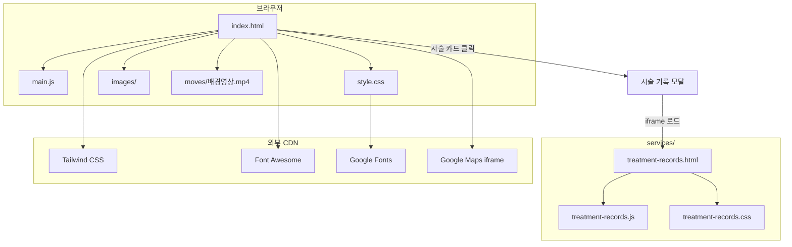
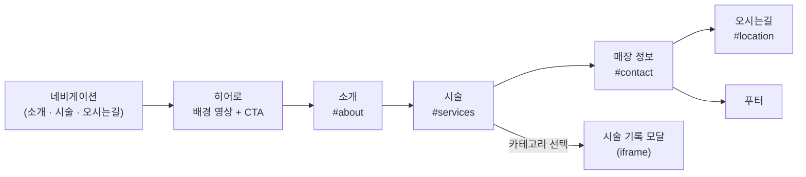
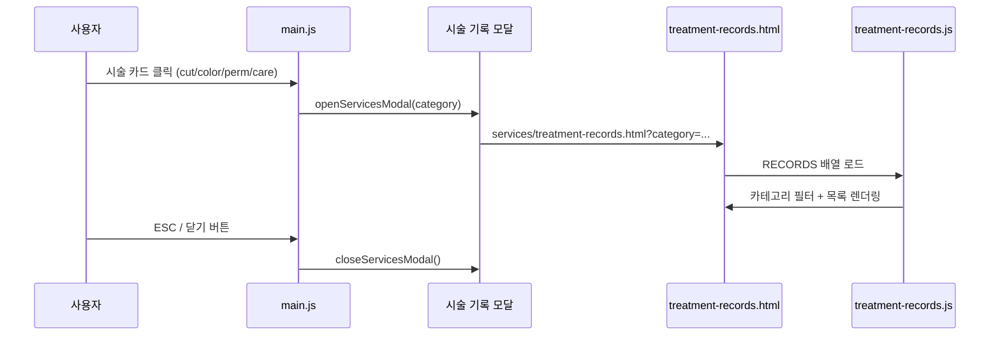
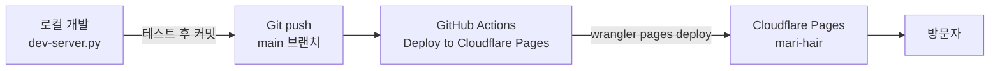

# 마리 헤어 (Mari Hair Salon)

성남시 분당구 정자동 **마리 헤어** 미용실의 공식 웹사이트입니다.  
정적 HTML/CSS/JavaScript로 구성되어 있으며, Cloudflare Pages에 배포됩니다.

## 주요 기능

| 기능 | 설명 |
|------|------|
| 랜딩 페이지 | 소개, 시술 안내, 매장 정보, 오시는 길 |
| 히어로 배경 영상 | `moves/배경영상.mp4` 자동 재생 |
| 다크 모드 | 시스템 설정 연동 + `localStorage` 저장 |
| 모바일 전화 예약 | 모바일에서 `tel:` 링크로 즉시 연결 |
| 시술 기록 모달 | 카테고리별 미용시술 기록을 iframe으로 표시 |
| 반응형 UI | 모바일·태블릿·데스크톱 대응 |

## 기술 스택

- **HTML5** — 시맨틱 마크업
- **CSS3** — 커스텀 스타일 (`style.css`, `services/treatment-records.css`)
- **JavaScript (Vanilla)** — UI 인터랙션 (`main.js`, `services/treatment-records.js`)
- **Tailwind CSS** — CDN (`cdn.tailwindcss.com`)
- **Font Awesome 6** — 아이콘
- **Google Fonts** — Noto Sans KR, Playfair Display
- **Python 3** — 로컬 개발 서버 (`dev-server.py`)
- **GitHub Actions + Wrangler** — Cloudflare Pages 자동 배포

## 프로젝트 구조

```
MariHair/
├── index.html              # 메인 페이지
├── main.js                 # 메인 페이지 스크립트
├── style.css               # 메인 페이지 스타일
├── dev-server.py           # 로컬 개발 서버 (no-cache)
├── _headers                # Cloudflare Pages 보안 헤더
├── .gitignore
├── .pagesignore            # Cloudflare Pages 배포 제외 목록
├── README.md
│
├── images/                 # 이미지 에셋
│   ├── .gitkeep
│   ├── 가격표.jpg / 가격표.png
│   ├── 배경.jpg
│   ├── 샴프.png
│   ├── 어서오세요.jpg
│   ├── 염색.jpg
│   ├── 컷트.jpg
│   └── 펌.jpg
│
├── moves/                  # 영상 에셋
│   ├── .gitkeep
│   └── 배경영상.mp4
│
├── services/               # 시술 기록 서브 페이지
│   ├── treatment-records.html
│   ├── treatment-records.js
│   └── treatment-records.css
│
├── games/                  # (예약 폴더, 현재 비어 있음)
├── env/                    # (예약 폴더, 현재 비어 있음)
├── logs/                   # 작업 로그 (배포 제외)
│
└── .github/
    └── workflows/
        └── deploy-cloudflare.yml   # Cloudflare Pages CI/CD
```

### 디렉터리 역할

| 경로 | 역할 |
|------|------|
| `/` (루트) | 메인 랜딩 페이지 및 공통 자산 |
| `images/` | 시술 카드, 소개, 가격표 등 정적 이미지 |
| `moves/` | 히어로 섹션 배경 영상 |
| `services/` | 시술 기록 페이지 (모달 iframe 대상) |
| `games/` | 향후 게임/부가 기능 확장용 |
| `env/` | 환경 설정 파일 보관용 (`.gitignore` 대상) |
| `.github/workflows/` | `main` 브랜치 push 시 자동 배포 |

## 구성도

### 전체 아키텍처



### 페이지 섹션 구성



### 시술 기록 데이터 흐름



### 배포 파이프라인



## 사용 방법

### 사전 요구 사항

- **Python 3** (로컬 서버 실행용)
- 최신 브라우저 (Chrome, Safari, Firefox, Edge)

### 로컬 개발 서버 실행

프로젝트 루트에서 아래 명령을 실행합니다.

```bash
python3 dev-server.py
```

브라우저에서 [http://localhost:8000](http://localhost:8000) 으로 접속합니다.

`dev-server.py`는 캐시를 비활성화하는 헤더를 붙여 개발 중 이전 파일이 남지 않도록 합니다.

### 대체 방법 (Python 내장 서버)

```bash
python3 -m http.server 8000
```

> 캐시 헤더가 없으므로 CSS/JS 수정 후에는 **강력 새로고침**(Ctrl+Shift+R)을 권장합니다.

### 페이지별 접근 경로

| URL | 설명 |
|-----|------|
| `/` | 메인 랜딩 페이지 |
| `/services/treatment-records.html` | 시술 기록 전체 목록 |
| `/services/treatment-records.html?category=cut` | 컷 & 스타일링 기록 |
| `/services/treatment-records.html?category=color` | 염색 / 탈색 기록 |
| `/services/treatment-records.html?category=perm` | 펌 / 매직 기록 |
| `/services/treatment-records.html?category=care` | 샴푸 / 두피 케어 기록 |

메인 페이지에서는 **시술** 섹션의 카드를 클릭하면 해당 카테고리가 자동 선택된 모달이 열립니다.

## 콘텐츠 수정 가이드

### 매장 연락처 변경

`main.js` 상단의 `SALON_PHONE` 값과 `index.html` 내 `tel:` 링크를 함께 수정합니다.

```javascript
const SALON_PHONE = '0317269790';
```

### 시술 기록 데이터 수정

`services/treatment-records.js`의 `RECORDS` 배열에 항목을 추가·수정합니다.  
고객명은 개인정보 보호를 위해 마스킹(`김*진` 형식)을 유지합니다.

### 이미지·영상 교체

| 용도 | 경로 |
|------|------|
| 히어로 배경 영상 | `moves/배경영상.mp4` |
| 소개 이미지 | `images/어서오세요.jpg` |
| 시술 카드 이미지 | `images/컷트.jpg`, `염색.jpg`, `펌.jpg`, `샴프.png` |

파일명을 바꿀 경우 `index.html`의 `src` 경로도 함께 수정해야 합니다.

### 스타일·스크립트 캐시 무효화

`index.html`의 쿼리 스트링 버전을 올립니다.

```html
<script src="main.js?v=9"></script>
<link rel="stylesheet" href="style.css?v=11">
```

## 배포

`main` 브랜치에 push하면 GitHub Actions가 Cloudflare Pages에 자동 배포합니다.

### 필요한 GitHub Secrets

| Secret | 설명 |
|--------|------|
| `CLOUDFLARE_API_TOKEN` | Cloudflare API 토큰 |
| `CLOUDFLARE_ACCOUNT_ID` | Cloudflare 계정 ID |

### 수동 배포 트리거

GitHub 저장소 → **Actions** → **Deploy to Cloudflare Pages** → **Run workflow**

### 배포에서 제외되는 항목

`.pagesignore`에 의해 아래 경로는 배포되지 않습니다.

- `.git/`, `.github/`
- `env/`, `logs/`, `terminals/`
- `바이브코딩.txt`

## 보안 헤더

`_headers` 파일로 Cloudflare Pages에 다음 헤더가 적용됩니다.

- `X-Frame-Options: SAMEORIGIN`
- `X-Content-Type-Options: nosniff`
- `Referrer-Policy: strict-origin-when-cross-origin`
- `Permissions-Policy: camera=(), microphone=(), geolocation=()`

## 매장 정보

| 항목 | 내용 |
|------|------|
| 상호 | 마리 헤어 (Mari Hair Salon) |
| 전화 | 031-726-9790 |
| 주소 | 성남시 분당구 정자동 219-2 |
| 영업시간 | 평일 10:00 – 19:00 (매주 일요일 휴무) |
| 사업자등록번호 | 559-30-00076 |

---

© 2026 Mari Hair Salon. All Rights Reserved.